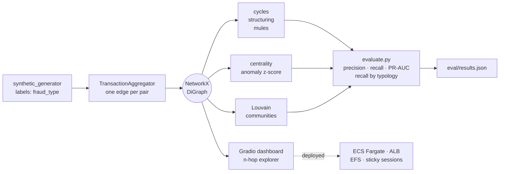

# Fraud Detection Graphs

Graph analytics for AML (anti-money-laundering) typologies: builds a directed client-to-client
transaction graph, runs classical graph algorithms over it, and **measures whether they actually find
the fraud that was planted**.

The measurement is the point. This started as a dashboard with seven rule-based detectors and no
evaluation at all. Adding `evaluate.py` changed what the project can honestly claim.

---


## Architecture



## What it does

1. **Generates synthetic AML data** with injected typologies: laundering cycles (A→B→C→A), structuring
   (many small transfers to one destination), and mule accounts. Every transaction is labelled with
   `is_fraudulent` and `fraud_type`.
2. **Builds a graph** with NetworkX. `EnhancedGraphBuilder` aggregates one edge per counterparty pair,
   carrying `num_transactions`, `total_amount` and type/channel breakdowns.
3. **Runs detectors**: centrality-based anomaly scoring, Louvain communities, and rule-based patterns
   for cycles, structuring and mules.
4. **Scores them against the labels** — precision, recall, F1, PR-AUC, and recall by typology.
5. **Serves a Gradio dashboard** for interactive n-hop exploration around a client.
6. **Deploys to AWS** with Terraform: ECS Fargate behind an ALB, EFS for persistence.

It is a **rules-and-metrics system, not a trained model.** Nothing is fitted, there is no train/test
split, and every threshold is hand-set. The evaluation exists precisely to show what that costs.

---

## Results

Seed 42 · 8 000 transactions · 800 clients · 8 % fraud · 7 749 edges / 1 439 nodes.
Reproduce with `python evaluate.py` (~37 s, no credentials, no AWS, no network).

### Node level — 1 439 clients, 407 fraud-positive

| Detector | flagged | precision | recall | F1 | PR-AUC |
|---|---|---|---|---|---|
| *baseline: flag-all* | 1 439 | 0.283 | 1.000 | 0.441 | — |
| `detect_outlier_nodes` | 331 | **0.456** | 0.371 | 0.409 | **0.393** |
| `FraudPatternDetector.detect_mule_accounts` | 785 | 0.135 | 0.260 | 0.178 | 0.271 |
| `identify_hub_nodes` (p90) | 165 | 0.206 | 0.084 | 0.119 | — |
| `detect_mules` | 3 | 0.000 | 0.000 | 0.000 | — |

### Pair level — 7 749 pairs, 389 fraud-positive

| Detector | flagged | precision | recall | F1 |
|---|---|---|---|---|
| *baseline: flag-all* | 7 749 | 0.050 | 1.000 | 0.096 |
| `detect_money_laundering_cycles` | 4 191 | 0.018 | 0.193 | 0.033 |
| `detect_structuring` (count >= 10) | 13 | **1.000** | 0.033 | 0.065 |
| `FraudPatternDetector.detect_structuring` | 13 | 0.923 | 0.031 | 0.060 |
| `flag_suspicious_edges` (p95 amount) | 388 | 0.036 | 0.036 | 0.036 |
| `detect_rapid_cycling` (<= 4 h) | 0 | 0.000 | 0.000 | 0.000 |

Louvain finds 20 communities (modularity 0.281); **four are 100 % fraud**, the next is 0.640. No
precision/recall is reported for it: it returns a partition, not a score, and inventing a flagging rule
would mean writing a new detector and scoring it as if it had been there all along.

---

## What the numbers actually say

### The aggregate row for the cycle detector is misleading

| typology | fraud pairs | detected | recall |
|---|---|---|---|
| `money_laundering` | 63 | **63** | **1.000** |
| `structuring` | 25 | 11 | 0.440 |
| `mule` | 301 | 1 | 0.003 |

It catches **every laundering cycle it was designed for**. Precision collapses to 0.018 for a separate
reason: a 7 749-edge transaction graph contains ~1 850 length-3/4 cycles naturally, and only ~21 were
planted. So: perfect recall on-typology, unusable precision without a secondary filter — amount
coherence, timing, or a risk cut on the cycle. Reporting only the aggregate F1 of 0.033 buries both
facts.

### A detector named `detect_mule_accounts` barely detects mules

Its aggregate F1 is 0.178, which reads as "weak but working". By typology:

| detector | `mule` | `money_laundering` | `structuring` |
|---|---|---|---|
| `FraudPatternDetector.detect_mule_accounts` | **0.029** | 0.983 | **1.000** |
| `detect_outlier_nodes` | **0.466** | 0.186 | 0.043 |
| `identify_hub_nodes` (p90) | 0.029 | **0.424** | 0.128 |

Almost all of its aggregate score comes from typologies that are **not** mules. It flags high-degree
nodes, and the accounts that run cycles and structuring are hubs, while most planted mules are the
degree-1 counterparties. A detector can look mediocre-but-useful in aggregate and be doing something
entirely different from what its name says.

The same table shows `detect_outlier_nodes` and `identify_hub_nodes` are **complementary, not
redundant**: each one is strong exactly where the other is weak. That is an ensembling argument you can
only make with a per-typology breakdown.

### Graphs over tabular, argued with a measurement instead of a slogan

The amount-based feature (`flag_suspicious_edges`) scores PR-AUC 0.048 against a prevalence floor of
0.050 — worse than random. The centrality-based detector reaches 0.393. On this data, transaction amount
carries no signal and topology does.

### Two detectors find nothing, and not because of a bug

`detect_mules` looks for in/out *imbalance* >= 0.7, but the generator builds *balanced* pass-through
mules. `detect_rapid_cycling` needs a reciprocal edge A→B and B→A, and the generator only emits
A→B→C→A. **The detectors and the data generator were written against different mental models of the
same fraud.** Nobody noticed until something measured it.

### Precision 1.000 at recall 0.033 is a trade, not a failure

Both structuring detectors flag almost nothing, and everything they flag is genuinely fraud. For an
alerting system a human analyst has to work through, that is often the right trade — but it should be a
deliberate choice, and without evaluation nobody knows they made it.

---

## Honest limitations

- **No model, no learning, no validation split.** Thresholds (`0.7` imbalance, `p90` degree,
  `count >= 10`, `4 h`) are hardcoded and were never calibrated against the labels. That is why the F1
  values sit between 0.00 and 0.44.
- **The generator fabricates counterparty IDs**: 639 of 1 439 nodes are degree-1 phantom leaves labelled
  fraudulent. No graph method can recover them, which caps node-level recall at ~0.27 regardless of
  detector.
- **`DiGraph` silently collapses data**: 251 of 8 000 transactions disappear into merged edges in the
  plain builder. Only `EnhancedGraphBuilder` aggregates correctly.
- **`risk_score` is label leakage.** It is derived from `is_fraudulent` and must never be used as a
  feature. `evaluate.py` scores it on purpose, to show it reaches PR-AUC 1.000 and why that number is
  worthless.
- **Doesn't scale as the config comments claim.** Exact betweenness is O(V·E) in Python: ~6 s at 1 439
  nodes.
- **No authentication on the deployed dashboard**, and HTTPS only exists if you supply a certificate ARN.
- **Cost is disproportionate** to the workload at the committed defaults: 2 NAT Gateways plus 2 Fargate
  tasks at 4 vCPU / 8 GB, running 24/7.
- Known open bugs: `detect_outlier_nodes` computes a `cutoff` it never applies, `detect_structuring`
  ignores its `window_days` parameter, and `FraudPatternDetector.detect_structuring` leaks the label into
  its own risk score.

---

## Three bugs the evaluation surfaced (fixed)

1. **The generator was not reproducible.** `list(set(mule_clients))` iterates in an order that depends on
   `PYTHONHASHSEED`, which is randomized per process, so the same seed produced a different dataset on
   every run. A second, independent cause: the enhanced-columns block drew from the global `random`
   module instead of the seeded instance. `test_reproducibility` missed both because it compared two
   calls *inside a single process*.
2. **The laundering-cycle detector could not run at realistic scale.** It called `nx.simple_cycles(G)`
   with no bound and filtered for length 3-4 *afterwards*, so it enumerated every simple cycle in the
   graph first (>200 000 and still running after 14 s). Passing `length_bound` — applying the constraint
   *before* enumeration rather than after — returns the same 1 850 cycles in 9 s.
3. **Nothing was measured.** Eleven tests existed and every one asserted a shape, a type or a range. Not
   one asserted that a detector finds a known fraud pattern.

---

## Run it

```bash
pip install -r requirements.txt

python evaluate.py          # ground-truth evaluation, ~37 s, writes eval/results.json
pytest                      # 11 tests
python -m dashboard         # Gradio UI on :7860
```

## Infrastructure

`antifraude-iac/` is 44 Terraform resources: VPC with public and private subnets and a NAT per AZ, ECS
Fargate in private subnets with no public IP, an internet-facing ALB with **`lb_cookie` session
stickiness**, EFS encrypted at rest and in transit, ECR with scan-on-push, autoscaling on CPU and
memory, and CloudWatch alarms.

The stickiness is the detail worth pointing at. Gradio keeps per-session state in `gr.State`, in the
task's own memory, so `desired_count = 2` behind a round-robin ALB breaks every other request.
Recognising that a stateful UI forces session affinity *before* deploying is the difference between
following a Terraform tutorial and running the thing.

## Stack

Python 3.11 · NetworkX · pandas · scikit-learn · python-louvain · Gradio · PyVis / Plotly ·
Terraform · AWS ECS Fargate / ALB / EFS / ECR

## License

MIT
